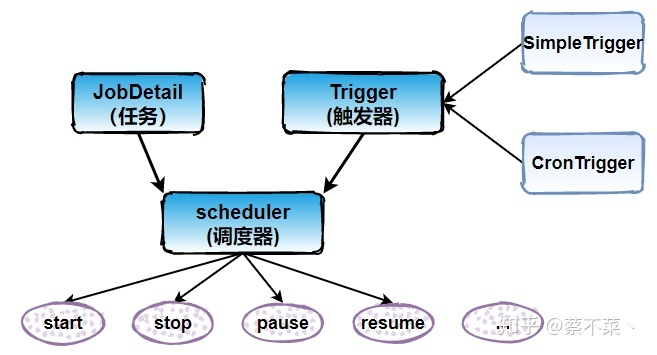

# 定时任务

**任务调度：**系统中创建了N个任务，每个任务按照指定的时间执行

## 一，Quartz

### 1，简介

开源丰富，可集成其他Java技术，应用广泛，是本文介绍的主要节点。

**核心：**

- 任务Job

  具体任务，执行的代码逻辑，继承 `org.quartz.jo`接口，实现`  **execute( )**  `方法

- 触发器Trigger

  执行任务的调度器，主要定义任务的执行时间，分为` **SimpleTrigger** `和` **CronTrigger**  `

- **调度器 Scheduler**

   **Scheduler** 为任务的调度器，它会将任务 **Job** 及触发器 **Trigger** 整合起来，负责基于 **Trigger** 设定的时间来执行 **Job** 

- JobDetail 工作明细

   **JobDetail** 是为 **Job** 实例提供了许多设置属性 

**体系：**

​	  

### 2，例子

> 导入依赖

```x&#39;m&#39;l
<dependency>
    <groupId>org.quartz-scheduler</groupId>
    <artifactId>quartz</artifactId>
    <version>2.3.2</version>
</dependency>
```

> 创建Job

```java
public class TestJob implements Job {
    @Override
    public void execute(JobExecutionContext jobExecutionContext) throws JobExecutionException {
        String now = LocalDateTime.now().format(DateTimeFormatter.ofPattern("yy-MM-dd HH:mm:ss"));
        System.out.println("当前时间是："+now);
    }
}
```

> 创建trigger和调度器

```java
public static void main(String[] args) throws SchedulerException {
        //获取任务调度的实例
        Scheduler scheduler = StdSchedulerFactory.getDefaultScheduler();
        //定义一个jobdetail 和要执行的任务绑定
        JobDetail jobdetail = JobBuilder.newJob(TestJob.class).withIdentity("TestJob", "testJobGroup").build();
        //定义触发器，并且设置执行的时间
        SimpleTrigger trigger = TriggerBuilder.newTrigger()
                .withIdentity("testTrigger", "testTriggerGroup")//身份证明
                .startNow()
                .withSchedule(SimpleScheduleBuilder.repeatSecondlyForever(10))
                .build();
        //使用任务调度器管理要执行的job和相对应的触发器
        Date date = scheduler.scheduleJob(jobdetail, trigger);
        System.out.println("调度器开始的时间是："+date);
        //开启任务
        scheduler.start();
    }
```

> 结果输出

```
调度器开始的时间是：Tue Aug 22 11:29:15 CST 2023
当前时间是：23-08-22 11:29:15
当前时间是：23-08-22 11:29:25
当前时间是：23-08-22 11:29:35
```

### 3，核心解析

#### 3.1 JOb和JObDetail

job是工作任务调度的接口， 任务类需要实现该接口。 每次调度器执行 **Job** 时，在调用 **execute** 方法之前都会创建一个新的 **Job** 实例，当调用完成后(调用完成是指定时任务结束)，关联的 **Job** 对象示例会被释放，释放的实例会被垃圾回收机制回收 

 **JobDetail** 是为 **Job** 实例提供了许多设置属性，以及 **JobDetailMap** 成员变量属性，它用来存储特定 **Job** 实例的状态信息，调度器需要借助 **JobDetail** 对象来添加 **Job** 实例 

**两者之间的关系：**

 **JobDetail** 定义的是任务数据，执行逻辑是是在 **Job** 中。因为任务是有可能并发执行，如果 **Scheduler** 直接使用 **Job** ，就会存在对同一个 **Job** 实例并发访问的问题。采用**JobDetail & Job** 方式， **Scheduler** 每次执行，都会根据 **JobDetail** 创建一个新的 **Job** 实例

#### 3.2 JobExecutionContext

当 **Scheduler** 调用一个 **Job** ，就会将 **JobExecutionContext** 传递给 **Job** 的 **execute()** 方法。这样子在**Job** 中就能通过 **JobExecutionContext** 对象来访问到 **Quartz** 运行时候的环境以及 **Job** 本身的明细数据。

#### 3.3 JobDataMap

 实现了**Map**接口，用来存取基本数据类型，也可以用来转载任何可序列化的数据对象，当 **Job** 实例对象被执行时这些参数对象会传递给它。 

```java
//任务调度类：
JobDetail jobDetail = JobBuilder.newJob(TestJob.class)
    .usingJobData("testJobDetail", "jobDetail数据存放")//要传递的数据
    .withIdentity("testJob", "testJobGroup")
    .build();
Trigger trigger = TriggerBuilder.newTrigger()
    .usingJobData("testTrigger", "trigger数据存放")
    .withIdentity("testTrigger", "testTriggerGroup")
    .startNow()
    .withSchedule(SimpleScheduleBuilder.repeatSecondlyForever(5))
    .build();
//Job 任务类
public void execute(JobExecutionContext jobExecutionContext) {
        System.out.println(jobExecutionContext.getJobDetail()
                           .getJobDataMap().get("testJobDetail"));
        System.out.println(jobExecutionContext.getTrigger()
                           .getJobDataMap().get("testTrigger"));
    }
```

方式二：

```java
public class TestJob implements Job {

    private String testJobDetail;

    public void setTestJobDetail(String testJobDetail) {
        this.testJobDetail = testJobDetail;
    }

    @Override
    public void execute(JobExecutionContext jobExecutionContext) {
        System.out.println(testJobDetail);
    }
}
/** OUTPUT:
jobDetail数据存放
**/
```

**说明**： 只要我们在Job实现类中添加对应key的setter方法，那么Quartz框架默认的JobFactory实现类在初始化 Job 实例对象时回自动地调用这些 setter 方法 。但是如果遇到同名的key，就会覆盖，比如在jobdetail和trigger中定义了相同你的key

#### 3.4 Job的状态

```java
//需求：统计任务执行的次数
//错误示范：JobDataMap 中定义了一个值为 0 的初始值
  JobDetail jobDetail = JobBuilder.newJob(TestJob.class)
    .usingJobData("executeCount", 0)
    .withIdentity("testJob", "testJobGroup")
    .build();  
//job类
public void execute(JobExecutionContext jobExecutionContext) {
        String data = LocalDateTime.now()
            .format(DateTimeFormatter.ofPattern("yyyy-MM-dd HH:mm:ss"));
        log.info("execute count: {}, current time: {}",
                 ++executeCount, data);
        //将累加的 count 存入JobDataMap中
        jobExecutionContext.getJobDetail()
            .getJobDataMap().put("executeCount", executeCount);
    }
//输出：每次打印都是1
//原因分析：因为在调用 execute 方法之前都会创建一个新的 Job 实例
-------------------------------------------------------------------------
无状态的job:每次调用时都会创建一个新的 JobDataMap
有状态的job:多次 Job 调用可以持有一些状态信息，这些状态信息存储在 JobDataMap 中
区别：添加  ===@PersistJobDataAfterExecution=====注解
    
@PersistJobDataAfterExecution    
public void execute(JobExecutionContext jobExecutionContext) {
        String data = LocalDateTime.now()
            .format(DateTimeFormatter.ofPattern("yyyy-MM-dd HH:mm:ss"));
        log.info("execute count: {}, current time: {}",
                 ++executeCount, data);
        //将累加的 count 存入JobDataMap中
        jobExecutionContext.getJobDetail()
            .getJobDataMap().put("executeCount", executeCount);
    }    
    
    
```

#### 3.5 Trigger

 我们定义了任务之后，需要用触发器 **Trigger** 去指定 **Job** 的执行时间，执行间隔，运行次数等 

一般情况主要使用的Trigger实现类有` CronTriggerImpl `和` SimpleTriggerImpl `

> SimpleTriggerImpl

 **SimpleTrigger** 对于设置和使用是最为简单的一种 **QuartzTrigger**，它是为那种需要在特定的日期/时间启动，且以一个可能的间隔时间重复执行 n次的 **Job任务** 所设计的 

```java
//在一个指定的时间段内执行一次任务
Trigger trigger = TriggerBuilder.newTrigger()
    .withIdentity("testTrigger", "testTriggerGroup")
    .startAt(startTime) //自定义执行时间
    .build();
//在指定的时间间隔内多次执行该任务
Trigger trigger = TriggerBuilder.newTrigger()
    .withIdentity("testTrigger", "testTriggerGroup")
    .withSchedule(SimpleScheduleBuilder.repeatSecondlyForever(5))
    .withRepeatCount(2)) // 每5秒执行一次，连续执行3次后停止，从 0 开始计数
    .build();
```

- **SimpleTrigger具备的属性有**：开始时间、结束时间、重复次数和重复的时间间隔
- **重复次数** 的值可以为 **0**、**正整数**、**或常量 SimpleTrigger.REPEAT_INDEFINITELY**
- 重复的时间间隔属性值必须大于 **0** 或长整型的正整数，以 **毫秒** 作为时间单位，当重复的时间间隔为 **0** 时，意味着与 **Trigger** 同时触发执行
- 结束时间和重复次数同时存在时，以结束时间优先

> CronTrigger

 **CronTrigger** 更加灵活，它是基于日历的作业调度器 , 可以在某个时间点执行 ， 也可以像 **SimpleTrigger** 那样执行一个开始时间和结束时间运行任务 

-  **Cron表达式** ： 是用来配置 **CronTrigger** 实例，它是一个由 **7** 个子表达式组成的字符串 

1. `Seconds`：秒
2. `Minutes`：分钟
3. `Hours`：小时
4. `Day-of-Month`：月中的哪几天
5. `Month`：月
6. `Day-of-Week`：周中的哪几天
7. `Year`：年

| 字段         | 是否必填 | 允许值              | 可用特殊字符     |
| ------------ | -------- | ------------------- | ---------------- |
| 秒           | 是       | 0-59                | ， - * /         |
| 分           | 是       | 0-59                | ， - * /         |
| 小时         | 是       | 0-23                | ， - * /         |
| 月中的哪几天 | 是       | 1-31                | ， - * / ? L W C |
| 月           | 是       | 1-12 或 JAN-DEC     | ， - * /         |
| 周中的哪几天 | 是       | 1-7 或 SUN-SAT      | ， - * / ? L C # |
| 年           | 否       | 不填写 或 1970-2099 | ， - * /         |

| 特殊符号 | 含义                                                         |
| -------- | ------------------------------------------------------------ |
| *        | 可用在所有字段中，表示对应时间域的每一个时刻，例如，***** 在分钟字段时，表示“每分钟” |
| ?        | 该字符只在日期和星期字段中使用，它通常指定为“无意义的值”，相当于点位符 |
| -        | 表达一个范围，如在小时字段中使用“10-12”，则表示从10到12点，即10,11,12 |
| ,        | 表达一个列表值，如在星期字段中使用“MON,WED,FRI”，则表示星期一，星期三和星期五 |
| /        | x/y表达一个等步长序列，x为起始值，y为增量步长值。如在分钟字段中使用0/15，则表示为0,15,30和45秒，而5/15在分钟字段中表示5,20,35,50，你也可以使用*/y，它等同于0/y |
| L        | 该字符只在日期和星期字段中使用，代表“Last”的意思，但它在两个字段中意思不同。L在日期字段中，表示这个月份的最后一天，如一月的31号，非闰年二月的28号；如果L用在星期中，则表示星期六，等同于7。但是，如果L出现在星期字段里，而且在前面有一个数值 X，则表示“这个月的最后X天”，例如，6L表示该月的最后星期五 |
| W        | 该字符只能出现在日期字段里，是对前导日期的修饰，表示离该日期最近的工作日。例如15W表示离该月15号最近的工作日，如果该月15号是星期六，则匹配14号星期五；如果15日是星期日，则匹配16号星期一；如果15号是星期二，那结果就是15号星期二。但必须注意关联的匹配日期不能够跨月，如你指定1W，如果1号是星期六，结果匹配的是3号星期一，而非上个月最后的那天。W字符串只能指定单一日期，而不能指定日期范围 |
| #        | 该字符只能在星期字段中使用，表示当月某个工作日。如6#3表示当月的第三个星期五(6表示星期五，#3表示当前的第三个)，而4#5表示当月的第五个星期三，假设当月没有第五个星期三，忽略不触发 |

 Cron表达式对特殊字符的大小写不敏感，对代表星期的缩写英文大小写也不敏感。 

```java
//使用实例
Trigger trigger = TriggerBuilder.newTrigger()
    .withIdentity("testTrigger", "testTriggerGroup")
    .withSchedule(CronScheduleBuilder.cronSchedule("0/5 * * 6 4 ?"))
    .build();
```

#### 3.6 Scheduler

 **Quartz** 是以模块的方式构建的，**Job** 和 **Trigger** 之间的结合需要靠 **Scheduler**。 

创建：

```
Scheduler scheduler = StdSchedulerFactory.getDefaultScheduler();
```

创建是通过 **Quartz** 默认的 **SchedulerFactory**，我们可以使用自定义参数（**Properties**）来创建和初始化 **Quartz** 调度器，配置参数一般存储在 **quartz.properties** 中。

我们上面是通过 **scheduleJob()** 方法来结合 **Job**和 **Trigger**，这个方法有个时间类型的返回值，我们可以获取到调度器开始的时间：

```
Date date = scheduler.scheduleJob(jobDetail, trigger);
```

 关联完任务和触发器，我们就可以启动任务调度了： 

```text
scheduler.start();
```

将任务调度挂起（暂停）：

```text
scheduler.standby(());
```

将任务关闭：

```text
shutdown(true);//表示等待所有正在执行的job执行完毕之后，再关闭Scheduler
shutdown(false);//表示直接关闭Scheduler
```

 单独执行一次：

```
scheduler.triggerJob(JobKey,JObMap);
```

我们再来了解下 **quartz.properties** 文件，先看一个示例： 

  

 也可以编写程序代码操作quartz.properties文件的内容： 

```java
// 创建工厂实例
StdSchedulerFactory factory = new StdSchedulerFactory();

// 创建配置工厂的属性对象
Properties props = new Properties();
props.put(StdSchedulerFactory.PROP_THREAD_POOL_CLASS, "org.quartz.simpl.SimpleThreadPool"); // 线程池定义
props.put("org.quartz.threadPool.threadCount", "5"); // 默认Scheduler的线程数

try {
    // 使用定义的属性初始化工厂
    factory.initialize(props);
    Scheduler scheduler = factory.getScheduler();
    scheduler.start();
} catch (SchedulerException e) {
    e.printStackTrace();
}
```


## 二，Timer和TimerTask

### 1，简介

 JDK自带的Timer API算是最古老的定时任务实现方式了。Timer是一种定时器工具，用来在一个后台线程计划执行指定任务。它可以安排任务“执行一次”或者定期“执行多次” 。现在已经不建议使用了，因为这个不支持捕获异常如果出现错误，任务会停止。

### 2，例子

```java
Timer timer = new Timer();
timer.schedule(new TimerTask() {
    @Override
    public void run() {
        System.out.println("定时执行的任务"+ LocalDateTime.now());
    }
},new Date(),4000L);//单位是毫秒
```

### 3，Api解析

```java
// 在指定延迟时间后执行指定的任务
schedule(TimerTask task,long delay);

// 在指定时间执行指定的任务。（只执行一次）
schedule(TimerTask task, Date time);

// 延迟指定时间（delay）之后，开始以指定的间隔（period）重复执行指定的任务
schedule(TimerTask task,long delay,long period);

// 在指定的时间开始按照指定的间隔（period）重复执行指定的任务
schedule(TimerTask task, Date firstTime , long period);

// 在指定的时间开始进行重复的固定速率执行任务
scheduleAtFixedRate(TimerTask task,Date firstTime,long period);

// 在指定的延迟后开始进行重复的固定速率执行任务
scheduleAtFixedRate(TimerTask task,long delay,long period);

// 终止此计时器，丢弃所有当前已安排的任务。
cancal()；

// 从此计时器的任务队列中移除所有已取消的任务。
purge()；
```

## 三，ScheduledThreadPool

### 1，简介

 ScheduledThreadPool是一个能实现**定时、周期性任务**的线程池。 每个调度任务都会分配到线程池中的一个线程去执行。也就是说，任务是并发执行，互不影响。

### 2，例子

```java
//创建一个3个线程的线程池
        ScheduledThreadPoolExecutor scheduled = new ScheduledThreadPoolExecutor(3);
        scheduled.scheduleAtFixedRate(new Runnable() {
            @Override
            public void run() {
                System.out.println("当前时间是：" + LocalDateTime.now());
                try {
                    Thread.sleep(4000);
                } catch (InterruptedException e) {
                    e.printStackTrace();
                }
            }
        }, 0, 10, TimeUnit.SECONDS);//0表示首次执行任务的延迟时间，10表示每次执行任务的间隔时间，第三个表示10的单位
```

间隔单位毫秒：TimeUnit.MILLISECONDS
间隔单位秒：TimeUnit.SECONDS
间隔单位分钟：TimeUnit.MINUTES
间隔单位小时：TimeUnit.HOURS
间隔单位天：TimeUnit.DAYS 

### 3，核心解析

#### 3.1 执行策略

>  在一定延迟之后只执行一次某个任务 

```java
//Api
public ScheduledFuture<?> schedule(Runnable command, long delay, TimeUnit unit);
public <V> ScheduledFuture<V> schedule(Callable<V> callable, long delay, TimeUnit unit);
//在delay指定的延迟之后执行第一个参数所指定的任务，区别在于，第二个方法执行之后会有返回值，而第一个方法执行之后是没有返回值的
```

>  在一定延迟之后周期性的执行某个任务 

```java
//Api
public ScheduledFuture<?> scheduleWithFixedDelay(Runnable command,
                                                 long initialDelay, long delay, TimeUnit unit);
public ScheduledFuture<?> scheduleAtFixedRate(Runnable command,
                                                  long initialDelay, long period, TimeUnit unit);
//在第二个参数（initialDelay）指定的时间之后开始周期性的执行任务，执行周期间隔为第三个参数指定的时间，但是这两个方法的区别在于第三个方法执行任务的间隔是固定的，无论上一个任务是否执行完成，而第四个方法的执行时间间隔是不固定的，其会在周期任务的上一个任务执行完成之后才开始计时，并在指定时间间隔之后才开始执行任务
```

## 四，SpringTask

### 1，简介

从Spring 3开始，Spring自带了一套定时任务工具Spring-Task，可以把它看成是一个轻量级的Quartz，除Spring相关的包外不需要额外的包，支持注解和配置文件两种形式。通常情况下在Spring体系内，针对简单的定时任务，可直接使用Spring提供的功能。

### 2，例子

```java
@Component("taskJob")
public class TaskJob {

    @Scheduled(cron = "0 0 3 * * ?")
    public void job1() {
        System.out.println("通过cron定义的定时任务");
    }

    @Scheduled(fixedDelay = 1000L)
    public void job2() {
        System.out.println("通过fixedDelay定义的定时任务");
    }

    @Scheduled(fixedRate = 1000L)
    public void job3() {
        System.out.println("通过fixedRate定义的定时任务");
    }
}
```

### 3，方法解析

#### 3.1 fixedDelay和fixedRate

-  fixedRate有一个时刻表的概念，在任务启动时，T1、T2、T3就已经排好了执行的时刻，比如1分、2分、3分，当T1的执行时间大于1分钟时，就会造成T2晚点，当T1执行完时T2立即执行。 
-  fixedDelay比较简单，表示上个任务结束，到下个任务开始的时间间隔。无论任务执行花费多少时间，两个任务间的间隔始终是一致的。 
