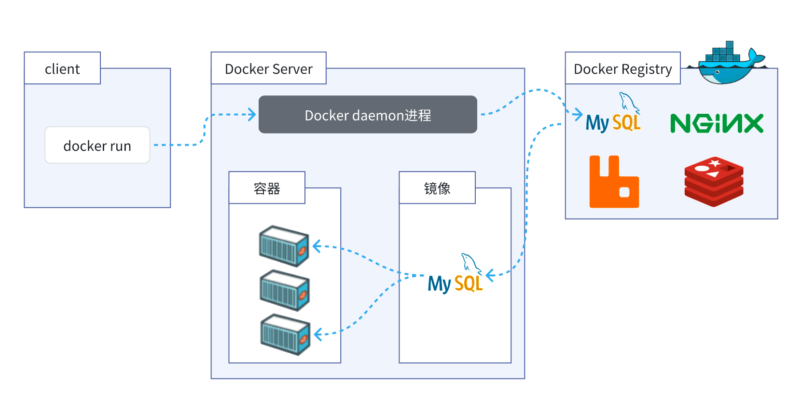
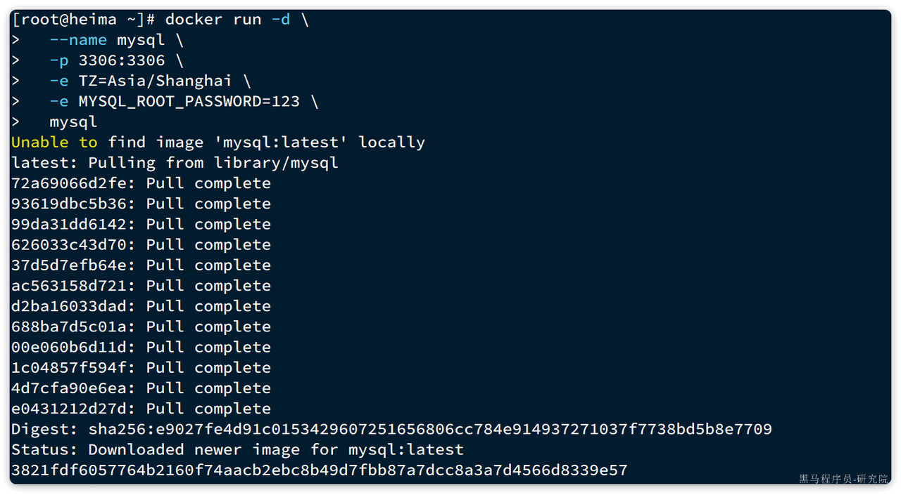
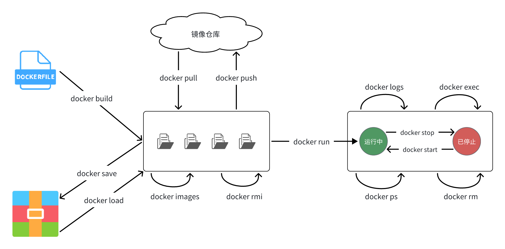
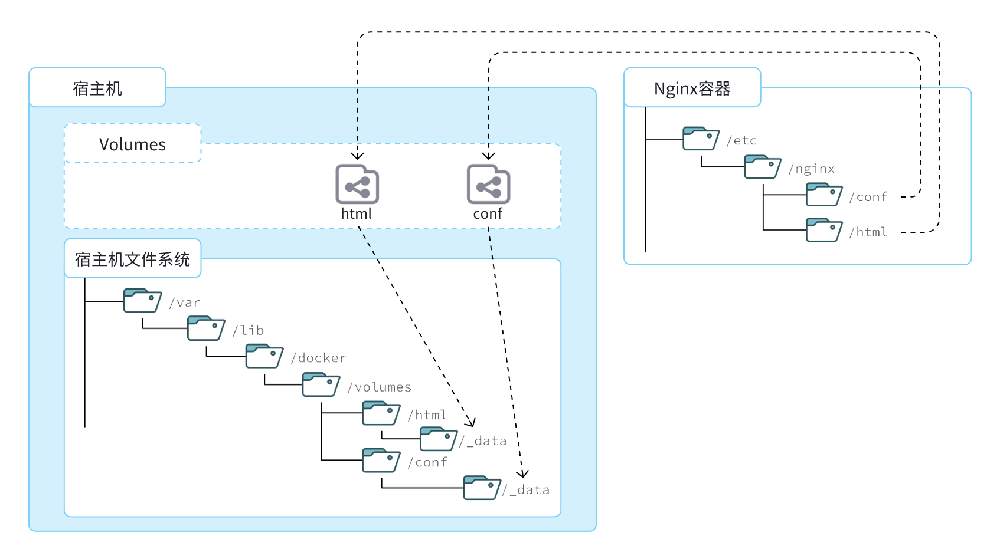
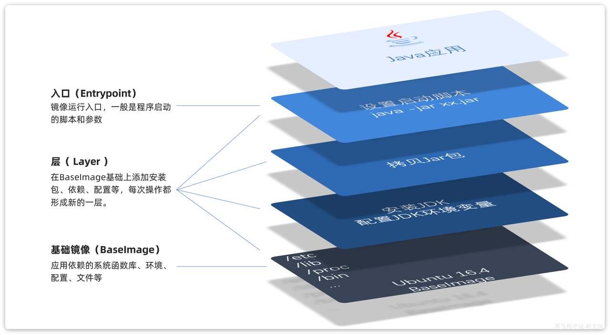

现行的手动部署缺点：

- 命令太多，软件包名字复杂，安装和部署步骤复杂，易出错
- 如果是微服务项目，要部署的东西就更多了
- 由于每台服务器的运行环境可能不同，项目包和脚本不一定能运行

docker技术优点：

- 可以统一部署
- 实现容器化部署，避免部署对于服务器的依赖

docker的安装：

```Shell
//首先如果系统中已经存在旧的Docker，则先卸载：
yum remove docker \
    docker-client \
    docker-client-latest \
    docker-common \
    docker-latest \
    docker-latest-logrotate \
    docker-logrotate \
    docker-engine
    
//配置Docker的yum库
yum install -y yum-utils'

//配置Docker的yum源
yum-config-manager --add-repo https://download.docker.com/linux/centos/docker-ce.repo

安装Docker
yum install -y docker-ce docker-ce-cli containerd.io docker-buildx-plugin docker-compose-plugin

//检验
docker可以使用systemctl管理


//配置成国内的镜像加速
我们默认pull的docker镜像是从Docker Hub来下载，由于其服务器在国外，速度会比较慢。因此我们可以配置成国内的镜像仓库，这样可以加速镜像的上传/下载
一般是阿里云
https://b11et3un53m.feishu.cn/wiki/Rfocw7ctXij2RBkShcucLZbrn2d

```

docker理解：

- Docker本身是后台服务
- 输入docker命令，docker首先去下载镜像（images）到本地
  - **镜像。**镜像中不仅包含软件，还包含了其运行所需要的环境、配置、系统级函数库。
  - 下载失去镜像仓库下载
- 根据镜像创建并允许容器(container)，应用部署完成
  - 容器内包含运行的独立环境，可以跨系统运行，也不需要手动再次配置环境。



```
//部署mysql
//命令
docker run -d \   -- 创建并运行一个容器，-d则是让容器以后台进程运行
  --name mysql \  -- 给容器起个名字叫mysql，你可以叫别的
  -p 3306:3306 \  -- 设置端口映射
  -e TZ=Asia/Shanghai \  -- 配置容器内进程运行时的一些参数
  -e MYSQL_ROOT_PASSWORD=123 \  --mysql密码
  mysql  -- 镜像名称，Docker会根据这个名字搜索并下载镜像
  
  
 -p 3306:3306
   - 容器是隔离环境，外界不可访问。但是可以将宿主机端口映射容器内到端口，当访问宿主机指定端口时，就是在访问容器内的端口了。
  - 容器内端口往往是由容器内的进程决定，例如MySQL进程默认端口是3306，因此容器内端口一定是3306；而宿主机端口则可以任意指定，一般与容器内保持一致。
  - 格式： -p 宿主机端口:容器内端口，示例中就是将宿主机的3306映射到容器内的3306端口
 -e TZ=Asia/Shanghai : 配置容器内进程运行时的一些参数
   - 格式：-e KEY=VALUE，KEY和VALUE都由容器内进程决定
  - 案例中，TZ=Asia/Shanghai是设置时区；MYSQL_ROOT_PASSWORD=123是设置MySQL默认密码
- mysql : 设置镜像名称，Docker会根据这个名字搜索并下载镜像
  - 格式：REPOSITORY:TAG，例如mysql:8.0，其中REPOSITORY可以理解为镜像名，TAG是版本号
  - 在未指定TAG的情况下，默认是最新版本，也就是mysql:latest
```



常见命令：

|    **命令**    |            **说明**            |
| :------------: | :----------------------------: |
|  docker pull   |            拉取镜像            |
|  docker push   |    推送镜像到DockerRegistry    |
| docker images  |          查看本地镜像          |
|   docker rmi   |          删除本地镜像          |
|   docker run   | 创建并运行容器（不能重复创建） |
|  docker stop   |          停止指定容器          |
|  docker start  |          启动指定容器          |
| docker restart |          重新启动容器          |
|   docker rm    |          删除指定容器          |
|   docker ps    |            查看容器            |
|  docker logs   |        查看容器运行日志        |
|  docker exec   |            进入容器            |
|  docker save   |     保存镜像到本地压缩文件     |
|  docker load   |     加载本地压缩文件到镜像     |
| docker inspect |        查看容器详细信息        |



```Shell
# 第1步，去DockerHub查看nginx镜像仓库及相关信息

# 第2步，拉取Nginx镜像
docker pull nginx

# 第3步，查看镜像
docker images
# 结果如下：
REPOSITORY   TAG       IMAGE ID       CREATED         SIZE
nginx        latest    605c77e624dd   16 months ago   141MB
mysql        latest    3218b38490ce   17 months ago   516MB

# 第4步，创建并允许Nginx容器
docker run -d --name nginx -p 80:80 nginx

# 第5步，查看运行中容器
docker ps
# 也可以加格式化方式访问，格式会更加清爽
docker ps --format "table {{.ID}}\t{{.Image}}\t{{.Ports}}\t{{.Status}}\t{{.Names}}"

# 第6步，访问网页，地址：http://虚拟机地址

# 第7步，停止容器
docker stop nginx

# 第8步，查看所有容器
docker ps -a --format "table {{.ID}}\t{{.Image}}\t{{.Ports}}\t{{.Status}}\t{{.Names}}"

# 第9步，再次启动nginx容器
docker start nginx

# 第10步，再次查看容器
docker ps --format "table {{.ID}}\t{{.Image}}\t{{.Ports}}\t{{.Status}}\t{{.Names}}"

# 第11步，查看容器详细信息
docker inspect nginx

# 第12步，进入容器,查看容器内目录
docker exec -it nginx bash
# 或者，可以进入MySQL
docker exec -it mysql mysql -uroot -p

# 第13步，删除容器
docker rm nginx
# 发现无法删除，因为容器运行中，强制删除容器
docker rm -f nginx
```

数据卷：

定义：就是一个虚拟的目录，连接着容器内目录和外部机器目录，从而实现修改容器内数据的目的

我们称为**挂载**,容器与数据卷的挂载要在创建容器时配置，对于创建好的容器，是不能设置数据卷的。而且**创建容器的过程中，数据卷会自动创建**



|       **命令**        |       **说明**       |
| :-------------------: | :------------------: |
| docker volume create  |      创建数据卷      |
|   docker volume ls    |    查看所有数据卷    |
|   docker volume rm    |    删除指定数据卷    |
| docker volume inspect | 查看某个数据卷的详情 |
|  docker volume prune  |      清除数据卷      |

挂载在数据卷目录下：

`/var/lib/docker/volumes`这个目录就是默认的存放所有容器数据卷的目录，其下再根据数据卷名称创建新目录，格式为`/数据卷名/_data`   

**mysql部署的时候自动创建了一个匿名的数据卷，用来存放mysql的数据**

```shell
# 1.首先创建容器并指定数据卷，注意通过 -v 参数来指定数据卷
docker run -d --name nginx -p 80:80 -v html:/usr/share/nginx/html nginx

# 3.查看数据卷详情
docker volume inspect html
# 结果
[
    {
        "CreatedAt": "2024-05-17T19:57:08+08:00",
        "Driver": "local",
        "Labels": null,
        "Mountpoint": "/var/lib/docker/volumes/html/_data",
        "Name": "html",
        "Options": null,
        "Scope": "local"
    }
]

# 4.查看/var/lib/docker/volumes/html/_data目录
ll /var/lib/docker/volumes/html/_data
# 可以看到与nginx的html目录内容一样，结果如下：
总用量 8
-rw-r--r--. 1 root root 497 12月 28 2021 50x.html
-rw-r--r--. 1 root root 615 12月 28 2021 index.html

# 5.进入该目录，并随意修改index.html内容
cd /var/lib/docker/volumes/html/_data
vi index.html

# 6.打开页面，查看效果

# 7.进入容器内部，查看/usr/share/nginx/html目录内的文件是否变化
docker exec -it nginx bash
```

挂载本地目录：
数据卷的目录结构较深，如果我们去操作数据卷目录会不太方便，我们可以直接挂在本地目录

```shell
# 挂载本地目录
-v 本地目录:容器内目录
# 挂载本地文件
-v 本地文件:容器内文件
```

镜像结构：

- 镜像就是一堆文件的集合（jdk，linux运行环境，jar包，启动脚本）
- 文件是按照操作的步骤分层叠加而成，每一层形成的文件都会单独打包标记唯一id 称为layer（层）
- 我们构建自己的镜像就可以使用别的打包好的通用镜像



打包镜像（**Dockerfile**）：

发布项目的时候需要把项目打包成镜像：

|    **指令**    |                   **说明**                   |
| :------------: | :------------------------------------------: |
|    **FROM**    |                 指定基础镜像                 |
|    **ENV**     |        设置环境变量，可在后面指令使用        |
|    **COPY**    |         拷贝本地文件到镜像的指定目录         |
|    **RUN**     |  执行Linux的shell命令，一般是安装过程的命令  |
|   **EXPOSE**   | 指定容器运行时监听的端口，是给镜像使用者看的 |
| **ENTRYPOINT** |     镜像中应用的启动命令，容器运行时调用     |

```
# 基础镜像
FROM openjdk:11.0-jre-buster   -- 别人打包好的
# 设定时区
ENV TZ=Asia/Shanghai
RUN ln -snf /usr/share/zoneinfo/$TZ /etc/localtime && echo $TZ > /etc/timezone
# 拷贝jar包
COPY docker-demo.jar /app.jar
# 入口
ENTRYPOINT ["java", "-jar", "/app.jar"]
```

```
# 进入镜像目录
cd /root/demo
# 开始构建
docker build -t docker-demo:1.0 .     -.表示在本目录打包镜像，也可以指定具体地址

```

不同服务之间的网络通信：

项目和mysql之间需要通信，

- 创建docker的时候，会默认创建一个网络（网关），创建容易默认加入这个网络，并且网络会随机分配一个ip地址给容器，ip地址不固定。
- 需要单独创建一个网络，并且把项目运行的容器加入其中，实现通信
  - 在自定义网络中，可以给容器起多个别名，默认的别名是容器名本身
  - 在同一个自定义网络中的容器，可以通过别名互相访问
- 同一个容器可以加入多个网络


|         **命令**          |         **说明**         |
| :-----------------------: | :----------------------: |
|   docker network create   |       创建一个网络       |
|     docker network ls     |       查看所有网络       |
|     docker network rm     |       删除指定网络       |
|   docker network prune    |     清除未使用的网络     |
|  docker network connect   | 使指定容器连接加入某网络 |
| docker network disconnect | 使指定容器连接离开某网络 |
|  docker network inspect   |     查看网络详细信息     |

```shell
# 1.首先通过命令创建一个网络
docker network create hmall

# 2.然后查看网络
docker network ls
# 结果：
NETWORK ID     NAME      DRIVER    SCOPE
639bc44d0a87   bridge    bridge    local   --默认创建的网络
403f16ec62a2   hmall     bridge    local
0dc0f72a0fbb   host      host      local
cd8d3e8df47b   none      null      local
# 其中，除了hmall以外，其它都是默认的网络

# 3.让dd和mysql都加入该网络，注意，在加入网络时可以通过--alias给容器起别名
# 这样该网络内的其它容器可以用别名互相访问！
# 3.1.mysql容器，指定别名为db，另外每一个容器都有一个别名是容器名
docker network connect hmall mysql --alias db
# 3.2.db容器，也就是我们的java项目
docker network connect hmall dd

# 4.进入dd容器，尝试利用别名访问db
# 4.1.进入容器
docker exec -it dd bash
# 4.2.用db别名访问
ping db
# 结果
PING db (172.18.0.2) 56(84) bytes of data.
64 bytes from mysql.hmall (172.18.0.2): icmp_seq=1 ttl=64 time=0.070 ms
64 bytes from mysql.hmall (172.18.0.2): icmp_seq=2 ttl=64 time=0.056 ms
# 4.3.用容器名访问
ping mysql
# 结果：
PING mysql (172.18.0.2) 56(84) bytes of data.
64 bytes from mysql.hmall (172.18.0.2): icmp_seq=1 ttl=64 time=0.044 ms
64 bytes from mysql.hmall (172.18.0.2): icmp_seq=2 ttl=64 time=0.054 ms
```

部署项目：

- 打包java项目
- 创建``Dockerfile`和jar包文件一起上传到服务器上
- 命令打包镜像
- 创建容器运行
- 创建前端容器nginx，配置html和conf，运行

使用DockerCompose部署项目：

​	docker-compose文件中可以定义多个相互关联的应用容器，每一个应用容器被称为一个服务（service），其语法和`docker run `非常类似。实现相互关联的docker容器的快速部署，通过模板文件`docker-compose.yml `

| **docker run 参数** | **docker compose 指令** |  **说明**  |
| :-----------------: | :---------------------: | :--------: |
|       --name        |     container_name      |  容器名称  |
|         -p          |          ports          |  端口映射  |
|         -e          |       environment       |  环境变量  |
|         -v          |         volumes         | 数据卷配置 |
|      --network      |        networks         |    网络    |

```shell
version: "3.8"

services:
  mysql:
    image: mysql
    container_name: mysql
    ports:
      - "3306:3306"
    environment:
      TZ: Asia/Shanghai
      MYSQL_ROOT_PASSWORD: 123
    volumes:
      - "./mysql/conf:/etc/mysql/conf.d"
      - "./mysql/data:/var/lib/mysql"
      - "./mysql/init:/docker-entrypoint-initdb.d"
    networks:
      - hm-net
  hmall:
    build: 
      context: .
      dockerfile: Dockerfile
    container_name: hmall
    ports:
      - "8080:8080"
    networks:
      - hm-net
    depends_on:
      - mysql
  nginx:
    image: nginx
    container_name: nginx
    ports:
      - "18080:18080"
      - "18081:18081"
    volumes:
      - "./nginx/nginx.conf:/etc/nginx/nginx.conf"
      - "./nginx/html:/usr/share/nginx/html"
    depends_on:
      - hmall
    networks:
      - hm-net
networks:
  hm-net:
    name: hmall
```

运行语法：

```
docker compose [OPTIONS] [COMMAND]
```

| **类型** |                        **参数或指令**                        |          **说明**           |
| :------: | :----------------------------------------------------------: | :-------------------------: |
| Options  |                              -f                              | 指定compose文件的路径和名称 |
|    -p    | 指定project名称。project就是当前compose文件中设置的多个service的集合，是逻辑概念 |                             |
| Commands |                              up                              |  创建并启动所有service容器  |
|   down   |                   停止并移除所有容器、网络                   |                             |
|    ps    |                      列出所有启动的容器                      |                             |
|   logs   |                      查看指定容器的日志                      |                             |
|   stop   |                           停止容器                           |                             |
|  start   |                           启动容器                           |                             |
| restart  |                           重启容器                           |                             |
|   top    |                        查看运行的进程                        |                             |
|   exec   |                 在指定的运行中容器中执行命令                 |                             |

```shell
# 1.进入root目录
cd /root

# 2.删除旧容器
docker rm -f $(docker ps -qa)

# 3.删除hmall镜像
docker rmi hmall

# 4.清空MySQL数据
rm -rf mysql/data

# 5.启动所有, -d 参数是后台启动
docker compose up -d
# 结果：
[+] Building 15.5s (8/8) FINISHED
 => [internal] load build definition from Dockerfile                                    0.0s
 => => transferring dockerfile: 358B                                                    0.0s
 => [internal] load .dockerignore                                                       0.0s
 => => transferring context: 2B                                                         0.0s
 => [internal] load metadata for docker.io/library/openjdk:11.0-jre-buster             15.4s
 => [1/3] FROM docker.io/library/openjdk:11.0-jre-buster@sha256:3546a17e6fb4ff4fa681c3  0.0s
 => [internal] load build context                                                       0.0s
 => => transferring context: 98B                                                        0.0s
 => CACHED [2/3] RUN ln -snf /usr/share/zoneinfo/Asia/Shanghai /etc/localtime && echo   0.0s
 => CACHED [3/3] COPY hm-service.jar /app.jar                                           0.0s
 => exporting to image                                                                  0.0s
 => => exporting layers                                                                 0.0s
 => => writing image sha256:32eebee16acde22550232f2eb80c69d2ce813ed099640e4cfed2193f71  0.0s
 => => naming to docker.io/library/root-hmall                                           0.0s
[+] Running 4/4
 ✔ Network hmall    Created                                                             0.2s
 ✔ Container mysql  Started                                                             0.5s
 ✔ Container hmall  Started                                                             0.9s
 ✔ Container nginx  Started                                                             1.5s

# 6.查看镜像
docker compose images
# 结果
CONTAINER           REPOSITORY          TAG                 IMAGE ID            SIZE
hmall               root-hmall          latest              32eebee16acd        362MB
mysql               mysql               latest              3218b38490ce        516MB
nginx               nginx               latest              605c77e624dd        141MB

# 7.查看容器
docker compose ps
# 结果
NAME                IMAGE               COMMAND                  SERVICE             CREATED             STATUS              PORTS
hmall               root-hmall          "java -jar /app.jar"     hmall               54 seconds ago      Up 52 seconds       0.0.0.0:8080->8080/tcp, :::8080->8080/tcp
mysql               mysql               "docker-entrypoint.s…"   mysql               54 seconds ago      Up 53 seconds       0.0.0.0:3306->3306/tcp, :::3306->3306/tcp, 33060/tcp
nginx               nginx               "/docker-entrypoint.…"   nginx               54 seconds ago      Up 52 seconds       80/tcp, 0.0.0.0:18080-18081->18080-18081/tcp, :::18080-18081->18080-18081/tcp
```

