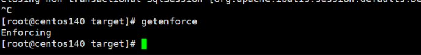
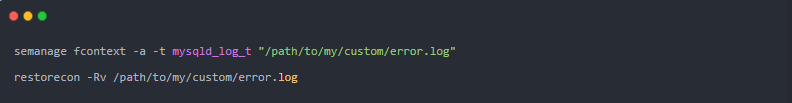

# SELinux和Mysql

 		为了提高 Linux 系统的安全性，在 Linux 上使用 SELinux 或 AppArmor 实现强制访问控制。

对于 MySQL 数据库的强制访问控制策略通常是激活的，如果用户采用默认的配置，对启动没有影响；

一旦用户修改了 MySQL 数据库的默认配置，例如默认的数据目录（一般是`/var/lib/mysql`）或监听端口(3306)，MySQL 数据库的活动就会被 SELinux 或 AppArmor 阻止，数据库无法启动。

本文简单介绍 SELinux 对 MySQL 数据库的影响。 

## 一，简介

​		SELinux(Secure Enhanced Linux)是一个内核级的安全机制，从 2.6 内核之后，集成到 Linux 内核中。它允许管理员细粒度地定义访问控制，未经定义的访问一律禁止。

SELinux 有三种工作模式：

- enforcing：强制模式。任何违反策略的行为都会被禁止，并且产生警告信息。
- permissive：允许模式。违反策略的行为不会被禁止，只产生警告信息。
- disabled：关闭 SELinux。

 使用 `getenforce` 命令来显示 SELinux 的当前模式。



更改模式使用 `setenforce 0`(设置为允许模式)或 `setenforce 1`(强制模式)。这些设置重启后就会失效;

也可以编辑 `/etc/selinux/config` 配置文件并设置 SELINUX 变量为 enforcing、permissive 或 disabled，保存设置让其重启后也有效。使用`sestatus`命令查看 SELinux 的状态： 


## **二、查看 MySQL 的 SELinux 的上下文**

可以使用 ps -Z 查看 mysqld 进程的 SELinux 的上下文：


也可以使用 ls -Z 查看 MySQL 数据目录的 SELinux 的上下文：


参数说明：

- system_u 是系统进程和对象的 SELinux 用户标识。
- system_r 是用于系统进程的 SELinux 角色。
- objects_r 是用于系统对象的 SELinux 角色。
- mysqld_t 是与 mysqld 进程相关的 SELinux 类型。
- mysqld_db_t 是与 MySQL 数据目录相关的 SELinux 类型。

## **三、修改对 MySQL 数据目录的访问控制**

如果我们把 MySQL 数据目录从默认的` /var/lib/mysql` 改成其他目录(可能没修改这个问题，不知道怎么了)，SELinux 将会阻止 mysqld 进程访问 MySQL 数据目录，从而造成 MySQL 无法启动，相关拒绝访问的信息记录在 `/var/log/audit/audit.log `文件中：


Mysql的日志文件`/var/log/mysql.log`报错为：


```
mysqld: File './binlog.index' not found (OS errno 13 - Permission denied)
```

​	我们可以 SELinux 关闭或改成允许模式后`setenforce 0`再启动 MySQL 数据库，但这种方法通常不推荐，因为这样会把所有的 SELinux 的安全策略都终止了，留下了安全隐患。

专业的做法是把新的 MySQL 数据目录增加到mysqld_db_t 这个 SELinux 类型中，

例如使用 `semanage fcontext` 命令的 -a 选项增加一个目录为``/home/mysql/data/mysql` 的 MySQL 数据目录，然后使用命令 restorecon 恢复这个数据目录对应的 SELinux 上下文；然后可以用 semanage fcontext 命令的 -l 选项进行检查，发现 mysqld_db_t 这个类型现在有两条记录，分别是系统默认的和刚才增加的：

再启动 mysqld 即可成功!

```
#安装命令
yum install policycoreutils-python
 
#把新的 MySQL 数据目录/home/mysql/data/mysql（和默认的/var/lib/mysql同级就可以）增加到mysqld_db_t 这个 SELinux 类型中
semanage fcontext -a -t mysqld_db_t "/home/mysql/data/mysql(/.*)?"
 
#使用命令 restorecon 恢复这个数据目录对应的 SELinux 上下文
restorecon -Rv /home/mysql/data/mysql
 
#用 semanage fcontext 命令的 -l 选项进行检查
semanage fcontext -l |grep mysqld_db_t
```


## **四、修改对 MySQL 其他对象的访问控制**

除了可以修改对 MySQL 数据目录的访问控制外，还可以采用类似的方法修改对其他 MySQL 对象的访问控制，例如：控制 MySQL 的错误日志的类型是 mysqld_log_t，采用下面的命令增加 MySQL 的错误日志的记录：



控制 MySQL 的 PID 文件的类型是 mysqld_var_run_t，采用下面的命令增加 MySQL 的 PID 文件的记录：


控制 MySQL 的监听端口的类型是 mysqld_port_t，采用下面的命令增加一个 3307 的监听端口：


 